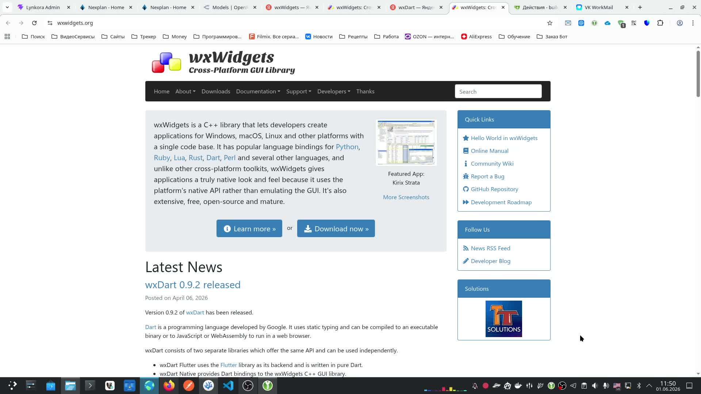
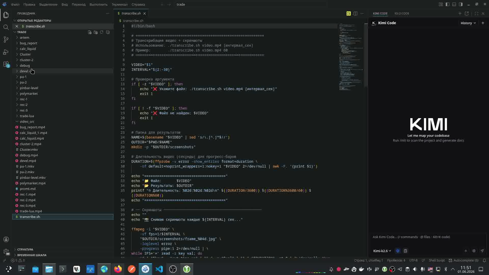
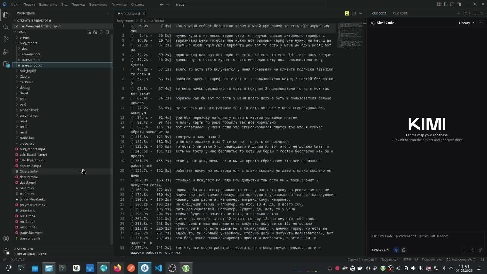
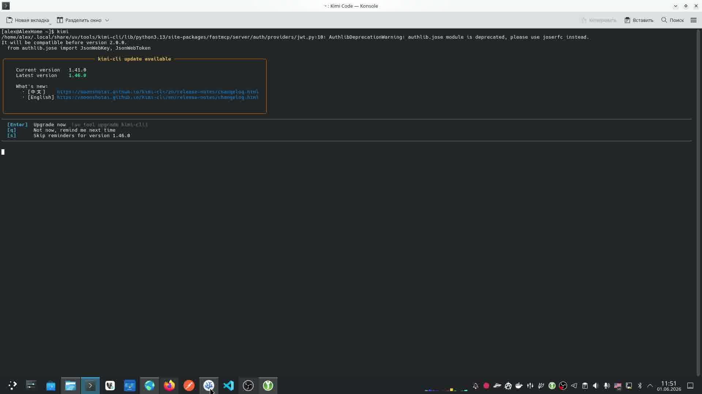
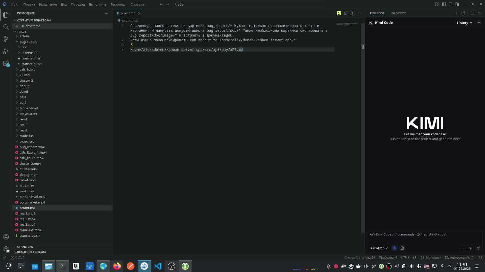

# Video2Doc — Автоматизированная генерация документации из видео

## Описание проекта

**Video2Doc** — это кроссплатформенное GUI-приложение, построенное на базе **wxWidgets**, предназначенное для автоматизации двухэтапного процесса:

1. **Этап 1 — Транскрибация**: извлечение скриншотов и текстовой транскрипции из видеофайла.
2. **Этап 2 — Генерация документации**: преобразование полученных скриншотов и текста в структурированную документацию с помощью AI-ассистента **Kimi Code CLI**.

Приложение предоставляет удобный графический интерфейс для настройки всех параметров процесса, управления шаблонами промптов и списком проектов.

---

## Скриншоты из видео-задания

### Рисунок 1 — Выбор технологии: wxWidgets

*Главная страница wxWidgets.org — выбранная кроссплатформенная GUI-библиотека для реализации проекта.*

### Рисунок 2 — Существующий скрипт транскрибации

*Существующий Bash-скрипт `transcribe.sh`, который выполняет извлечение кадров (ffmpeg) и транскрибацию речи (faster_whisper). Его логика будет интегрирована в приложение.*

### Рисунок 3 — Результат транскрибации

*Пример сгенерированного файла `transcript.txt` с временными метками и распознанным текстом.*

### Рисунок 4 — Запуск Kimi Code CLI

*Терминал с запущенным Kimi Code CLI — инструментом для AI-генерации документации на основе промпта.*

### Рисунок 5 — Шаблон промпта

*Файл `promt.md` содержит шаблон промпта, передаваемый Kimi. Пользователь должен иметь возможность редактировать этот шаблон прямо в интерфейсе приложения.*

---

## Основные возможности

| Возможность | Описание |
|-------------|----------|
| **Выбор видео** | Диалог выбора видеофайла через `wxFileDialog`. |
| **Интервал скриншотов** | Настраиваемый интервал извлечения кадров (по умолчанию 1 сек). |
| **Настройка путей** | Все пути (видео, выходная папка, проекты) задаются через GUI. |
| **Управление проектами** | Список дополнительных проектов с возможностью добавления/удаления. |
| **Редактор промптов** | Встроенный редактор шаблона `promt.md` с подсветкой синтаксиса. |
| **Интеграция с Kimi** | Запуск Kimi Code CLI через `wxProcess` с передачей параметров. |
| **Прогресс выполнения** | Индикация прогресса обоих этапов через `wxGauge` и лог-окно. |
| **Кроссплатформенность** | Работа на Windows, macOS и Linux благодаря wxWidgets. |

---

## Структура документации

- [`requirements.md`](requirements.md) — функциональные и нефункциональные требования.
- [`architecture.md`](architecture.md) — архитектура приложения, диаграмма компонентов.
- [`workflow.md`](workflow.md) — пошаговый рабочий процесс двух этапов.
- [`gui-spec.md`](gui-spec.md) — спецификация графического интерфейса.
- [`wxwidgets-reference.md`](wxwidgets-reference.md) — справочник по используемым классам wxWidgets.

---

## Технологический стек

| Компонент | Технология |
|-----------|------------|
| GUI-фреймворк | **wxWidgets** (C++) |
| Видео-обработка | **ffmpeg** (через `wxProcess`) |
| Транскрибация | **faster_whisper** (Python, через `wxProcess`) |
| AI-генерация | **Kimi Code CLI** (через `wxProcess`) |
| Конфигурация | JSON / wxConfig |
| Сборка | CMake |

---

## Лицензия

Проект разрабатывается как внутренний инструмент. Используемые сторонние компоненты распространяются под собственными лицензиями (wxWidgets — wxWindows Library Licence, ffmpeg — LGPL/GPL, faster_whisper — MIT).
